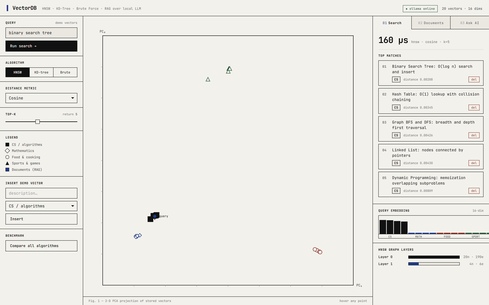
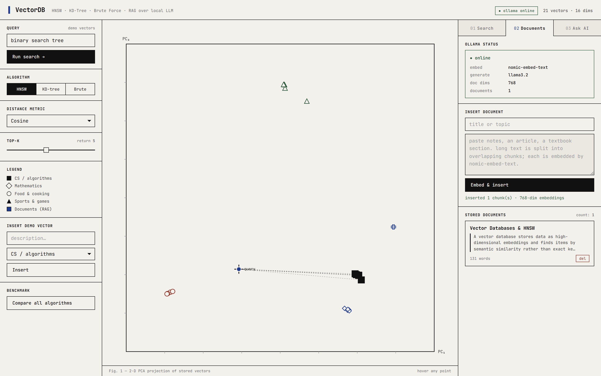
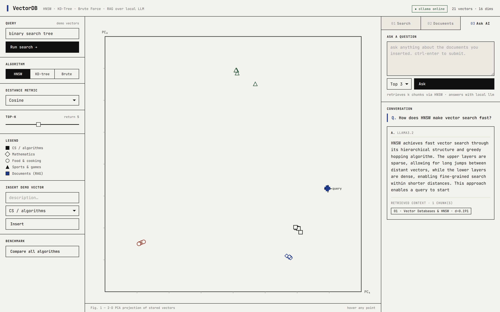
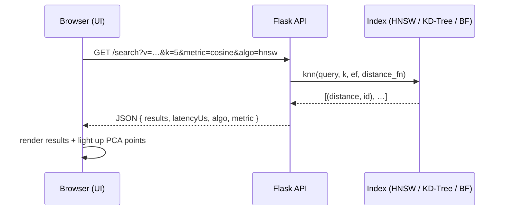
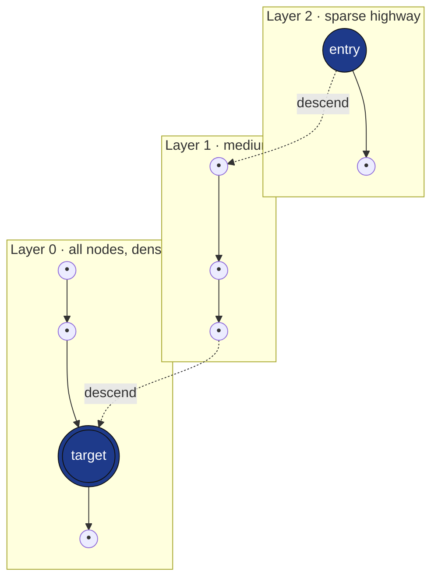
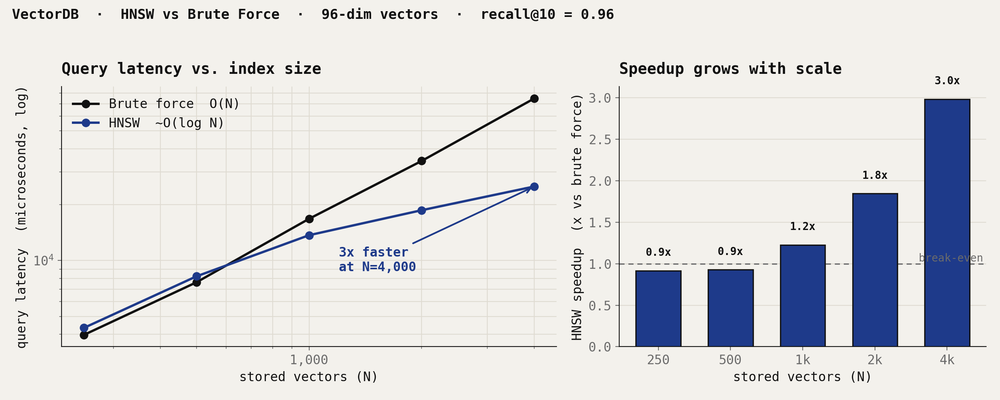

<div align="center">

# Vectra

### A vector database built from scratch in Python — HNSW, KD-Tree & Brute Force, with a local-LLM RAG pipeline

No `faiss`. No `hnswlib`. No `numpy`. Every index, distance metric, and graph traversal is written by hand so you can **see exactly how a vector database works under the hood.**


</div>

---

## What is this?

Tools like **Pinecone, Weaviate, and Chroma** are black boxes. Vectra opens the box. It’s a working vector database that stores text as high-dimensional embeddings, finds items by **semantic similarity** instead of keyword matching, and answers questions about your own documents using a **local LLM** — all on your machine, no API keys, no internet.

It ships with an interactive web UI: type a concept, watch the nearest vectors light up on a live 2-D projection, compare three search algorithms side by side, and run a full **retrieval-augmented generation (RAG)** loop.

<div align="center">

| | |
|---|---|
| **3** search algorithms from scratch | HNSW · KD-Tree · Brute Force |
| **3** distance metrics | Cosine · Euclidean · Manhattan |
| **768-dim** real embeddings | via `nomic-embed-text` (Ollama) |
| **~930** lines of Python | one file, zero ML libraries |

</div>

---

## Table of contents

- [See it in action](#see-it-in-action)
- [How it works](#how-it-works)
- [The three search algorithms](#the-three-search-algorithms)
- [Performance: where HNSW wins](#performance-where-hnsw-wins)
- [Built from scratch](#built-from-scratch)
- [REST API](#rest-api)
- [Quick start](#quick-start)
- [Project structure](#project-structure)
- [Notes & limitations](#notes--limitations)

---

## See it in action

### 🔍 Semantic search with a live vector-space map

Type any concept. Vectra converts it to a vector, runs the selected index, and highlights the nearest neighbours on a **2-D PCA projection** of the embedding space. Watch the four categories (CS, Math, Food, Sports) separate into natural clusters — that separation *is* semantic meaning made visible.

<div align="center">

<br><em>Searching “binary search tree” → the query lands inside the CS cluster and returns the 5 nearest concepts by cosine distance in 160 µs.</em>
</div>

### 📄 Embed real documents into 768-dim vectors

Paste notes, an article, or a textbook section. Vectra splits long text into **overlapping chunks**, sends each to `nomic-embed-text` running locally in Ollama, and indexes the resulting 768-dimensional vectors in HNSW.

<div align="center">

<br><em>A document embedded into a single 768-dim chunk — it appears as a new blue point on the map, far from the demo clusters.</em>
</div>

### 🤖 Ask questions — RAG over a local LLM

Ask anything. Vectra embeds your question, retrieves the most similar chunks with HNSW, and passes them as context to `llama3.2`. The answer is **grounded in your documents**, and the retrieved chunk + its distance are shown for transparency.

<div align="center">

<br><em>“How does HNSW make vector search fast?” → llama3.2 answers using the retrieved chunk (<code>d = 0.191</code>), fully offline.</em>
</div>

---

## How it works

### The RAG pipeline


### What happens on a search request



### Why HNSW is fast — the multilayer graph

HNSW (**H**ierarchical **N**avigable **S**mall **W**orld) is the algorithm behind Pinecone, Weaviate, Chroma, and Milvus. It builds a graph in **layers**: upper layers are sparse “highways” for big jumps across the space; lower layers are dense for fine-grained search. A query enters at the top and **greedily hops toward closer neighbours**, descending one layer at a time — so it skips most of the dataset instead of scanning all of it.



> Each search starts at the top entry point, greedily walks to the closest node on that layer, then drops down and repeats — giving roughly **O(log N)** query time instead of **O(N)**.

---

## The three search algorithms

All three are implemented from scratch and run **live** on every query so you can compare them directly.

| Algorithm | Idea | Complexity (query) | Best for |
|---|---|---|---|
| **Brute Force** | Compare the query to every stored vector | `O(N · d)` | Exact ground truth; small N |
| **KD-Tree** | Binary space partition with axis-aligned pruning | `O(log N)` low-dim → `O(N)` high-dim | Low-dimensional data (≤ ~20 D) |
| **HNSW** | Greedy descent through a multilayer proximity graph | `~O(log N)` | High-dimensional embeddings at scale |

> **Why not just KD-Tree everywhere?** Its pruning collapses above ~20 dimensions (the *curse of dimensionality*), degrading to a full scan. HNSW’s graph traversal doesn’t rely on axis splits, which is why it stays fast at 768-D. Vectra lets you feel this difference yourself.

---

## Performance: where HNSW wins

A vector index only pays off past a certain size. Below is a **real benchmark** run with Vectra’s own `HNSW` and `BruteForce` classes on 96-dimensional random vectors (40 queries each, `k = 10`).

<div align="center">

</div>

| Vectors (N) | Brute force | HNSW | Speedup | Recall@10 |
|---|---|---|---|---|
| 250 | 3,974 µs | 4,335 µs | 0.9× | 1.00 |
| 500 | 7,638 µs | 8,224 µs | 0.9× | 1.00 |
| 1,000 | 16,798 µs | 13,703 µs | **1.2×** | 0.99 |
| 2,000 | 34,447 µs | 18,686 µs | **1.8×** | 0.94 |
| 4,000 | 74,819 µs | 25,083 µs | **3.0×** | 0.85 |

**Reading the chart:** at small N, HNSW is *slightly slower* — the graph-traversal overhead isn’t worth it yet. Around **N ≈ 1,000 the lines cross**, and from there brute force grows linearly while HNSW barely moves, reaching **~3× faster at 4,000 vectors** — a gap that keeps widening. Recall stays near-perfect early and trades off gracefully as N grows (tunable via the `ef` search parameter).

> Reproduce it yourself: the benchmark script imports the real classes from `main.py` — no synthetic shortcuts.

---

## Built from scratch

| Component | Implementation |
|---|---|
| **HNSW** | Probabilistic level assignment, multilayer graph, greedy descent, `ef`-bounded beam search with dual heaps, bidirectional linking, neighbour pruning on over-connection |
| **KD-Tree** | Recursive binary space partition, nearest-neighbour search with subtree pruning via a bounded max-heap |
| **Brute Force** | Exact `O(N·d)` baseline — also the ground truth for recall |
| **Distance metrics** | Cosine, Euclidean, Manhattan — from first principles, pluggable per query |
| **Text chunker** | Overlapping sliding window (250 words, 30-word overlap) |
| **RAG pipeline** | Chunk → embed → HNSW retrieve → prompt-assemble → local LLM generate |
| **REST API** | Full CRUD + search + benchmark + graph introspection (Flask) |

**Zero ML dependencies in the engine** — no faiss, hnswlib, scikit-learn, or numpy. Just `flask` + `requests`.

---

## REST API

| Method | Endpoint | Purpose |
|---|---|---|
| `GET` | `/search?v=…&k=&metric=&algo=` | k-NN search on the demo index |
| `POST` | `/insert` | Insert a 16-D demo vector |
| `DELETE` | `/delete/<id>` | Remove a vector |
| `GET` | `/items` | List all stored vectors |
| `GET` | `/benchmark?v=…` | Time all three algorithms on one query |
| `GET` | `/hnsw-info` | HNSW graph structure (nodes/edges per layer) |
| `POST` | `/doc/insert` | Chunk + embed a document via Ollama |
| `POST` | `/doc/ask` | RAG: retrieve context + generate an answer |
| `GET` | `/status` | Ollama availability + model info |

---

## Quick start

```bash
git clone https://github.com/Pandeyycodes/Vectra-.git
cd Vectra-
pip install -r requirements.txt
python main.py
# open http://localhost:8080
```

The **search, benchmark, and PCA map work out of the box**. Document embedding and the RAG pipeline additionally need [Ollama](https://ollama.com) with two models:

```bash
ollama pull nomic-embed-text
ollama pull llama3.2
```

> Full step-by-step guide (Windows-friendly): **[SETUP.md](SETUP.md)**

---

## Project structure

```
Vectra-/
├── main.py            # Engine + REST API — HNSW, KD-Tree, BruteForce, RAG (~930 lines)
├── index.html         # Single-file web UI: PCA map, search, benchmark, RAG chat
├── requirements.txt   # flask, requests
├── SETUP.md           # Full installation guide
└── assets/            # Screenshots + benchmark chart
```

---

## Notes & limitations

Honest engineering trade-offs (and what I’d do next):

- **In-memory only.** State lives in RAM and resets on restart — there’s no disk persistence yet. Next step: a write-ahead log + snapshot loader.
- **Pure-Python distance functions.** Readability was the goal over raw speed; vectorising the hot loop (SIMD / batched math) would cut latency substantially.
- **HNSW deletion is `O(N)`** — it scans every node’s adjacency to unlink. Production systems use *tombstones* + periodic compaction; that’s the natural next improvement.
- **Recall is tunable.** Higher `ef` at query time raises recall toward 1.0 at the cost of latency — the classic ANN speed/accuracy dial.

These are deliberate scope choices for a from-scratch learning project, not oversights — the point is to make the core algorithms legible.

---

<div align="center">

**Built to understand vector databases from first principles.**

MIT License

</div>
