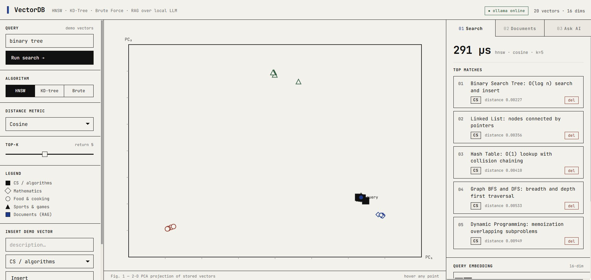
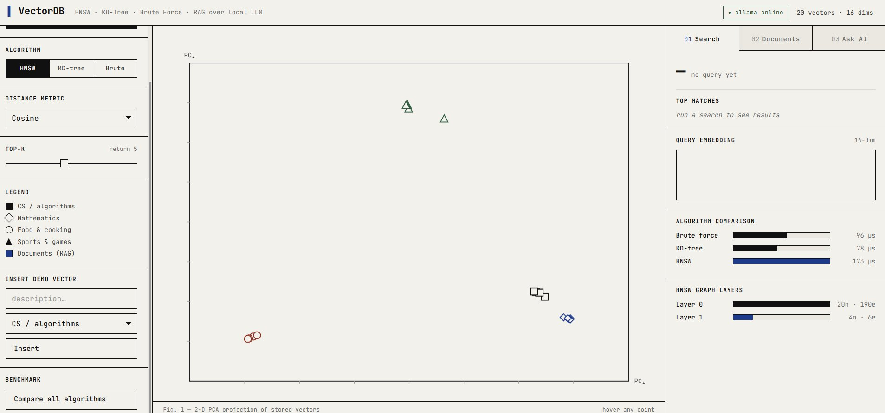
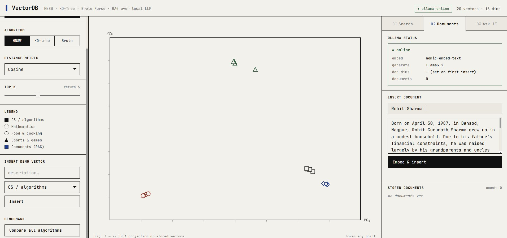
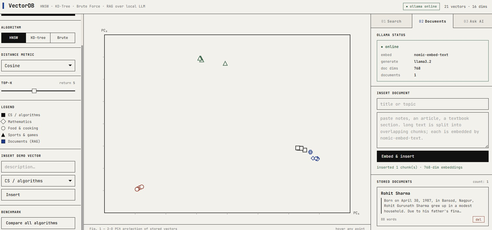
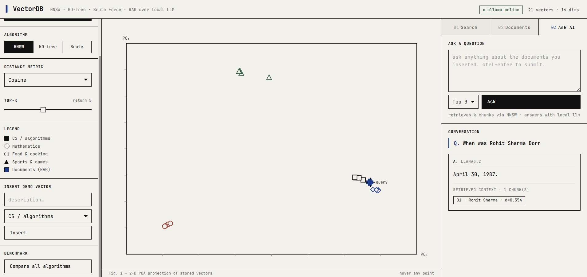

# Vectra — Vector Database from Scratch in Python


> A production-grade vector database engine built entirely from scratch — no faiss, no hnswlib, no numpy. Every data structure, every search algorithm, every distance metric written by hand in pure Python.

---

## Why I Built This

Tools like Pinecone, Weaviate, and Chroma are black boxes. I wanted to understand exactly what happens when you call `.search()` — how vectors are indexed, why HNSW beats brute force at scale, and what a RAG pipeline actually does at the code level. So I built one.

---

## Semantic Search — 291μs on HNSW

Type any concept. The engine finds the nearest vectors in embedding space and lights them up on the scatter plot in real time.



Searching `binary tree` returns CS concepts ranked by cosine distance — Binary Search Tree (0.00227), Linked List (0.00356), Hash Table (0.00410). Notice the 4 semantic clusters on the scatter plot: CS (squares), Math (diamonds), Food (circles), Sports (triangles) — each category naturally separates in vector space.

---

## Algorithm Benchmarking — All 3 Side by Side



All three indexes run on every query so you can compare them live. The HNSW graph layers panel shows the index structure: Layer 0 holds all 20 nodes with 190 edges; Layer 1 holds only 4 nodes — the "highway" layer that makes search fast at scale.

---

## Real Document Embedding — 768 Dimensions via Ollama



Paste any text. The engine chunks it, sends each chunk to `nomic-embed-text` running locally via Ollama, and gets back a 768-dimensional embedding vector — the same dimensionality used in production systems.



After embedding, the document appears as a new point on the scatter plot (blue square, bottom right). The status panel confirms: 768-dim embeddings, 1 document stored.

---

## RAG Pipeline — Ask Questions About Your Documents



Ask anything. The engine embeds your question, runs HNSW search to find the most semantically similar chunks, and passes them as context to `llama3.2` running locally. No API keys. No internet. Runs entirely on your machine.

The scatter plot shows the query vector landing next to the Rohit Sharma document — that's HNSW retrieval working visually in real time.

---

## What's Built from Scratch

| Component | Implementation |
|---|---|
| **HNSW** | Multilayer graph, greedy descent, beam search with priority queue, bidirectional neighbor linking |
| **KD-Tree** | Binary space partitioning, axis-aligned pruning |
| **Brute Force** | Exact O(N·d) baseline |
| **Distance Metrics** | Cosine similarity, Euclidean, Manhattan — all from first principles |
| **PCA** | 2D projection of high-dimensional vectors for the scatter plot |
| **Text Chunker** | Overlapping 250-word sliding window |
| **REST API** | Full CRUD: insert, delete, search, benchmark, RAG |

Zero ML libraries. No faiss, no hnswlib, no scikit-learn, no numpy.

---

## Tech Stack

- **Backend:** Python, Flask (~650 lines)
- **Local LLM:** Ollama — `nomic-embed-text` (768D embeddings) + `llama3.2` (generation)
- **Frontend:** Vanilla JS + HTML/CSS — scatter plot, RAG chat, benchmark dashboard

---

## Quick Start

```bash
git clone https://github.com/Pandeyycodes/Vectra-.git
cd Vectra-
pip install -r requirements.txt
python main.py
# open http://localhost:8080
```

> Requires Ollama for embeddings and RAG. Full setup guide: [SETUP.md](SETUP.md)

---

## How HNSW Works

Nodes live in a multilayer graph. Higher layers are exponentially sparser and act as highways — search starts at the top, greedily descends to the nearest node per layer, then does a full beam search at layer 0. This gives O(log N) complexity instead of O(N) for brute force — the same reason Pinecone, Weaviate, and Chroma all use it.

KD-Tree pruning breaks down above ~20 dimensions (curse of dimensionality). HNSW's graph traversal doesn't have this problem, which is why it wins at 768D.

---

## License

MIT
